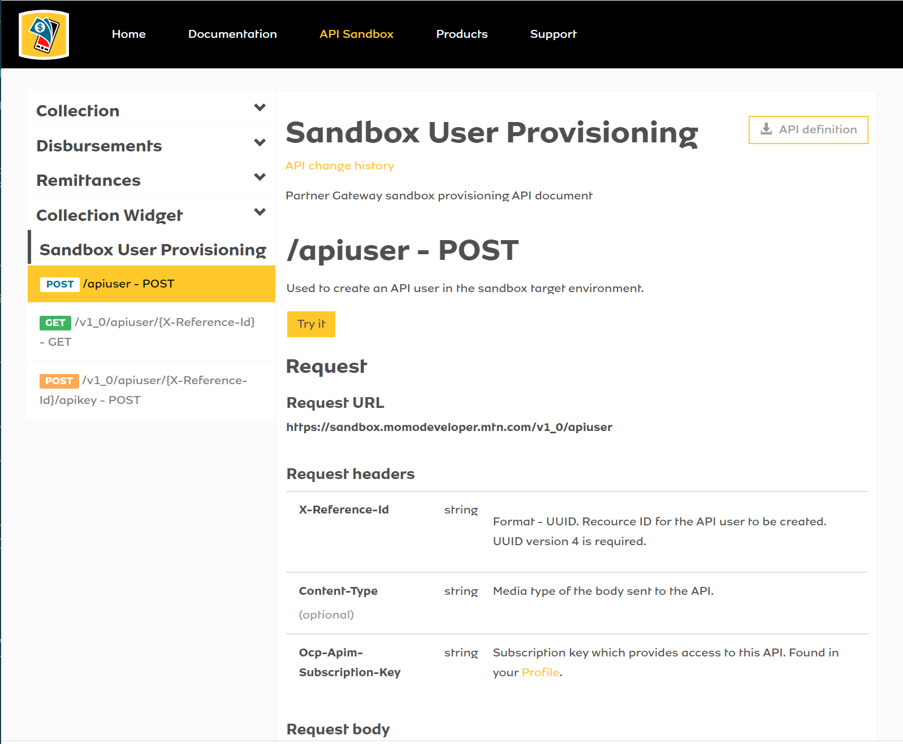
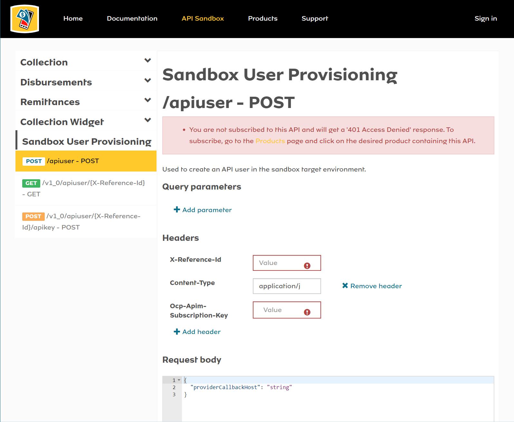
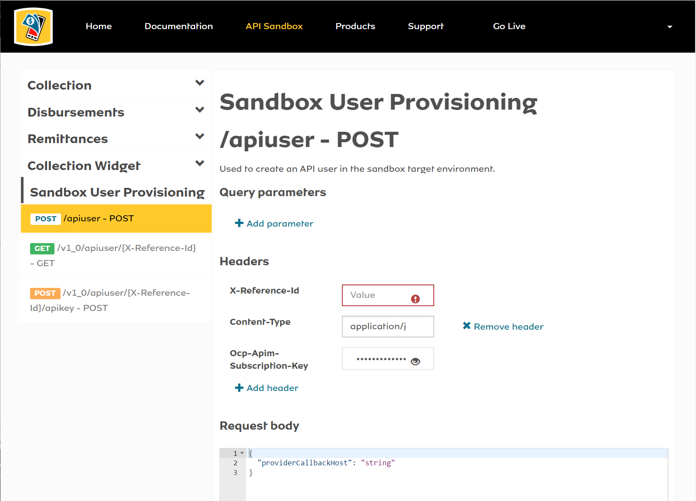
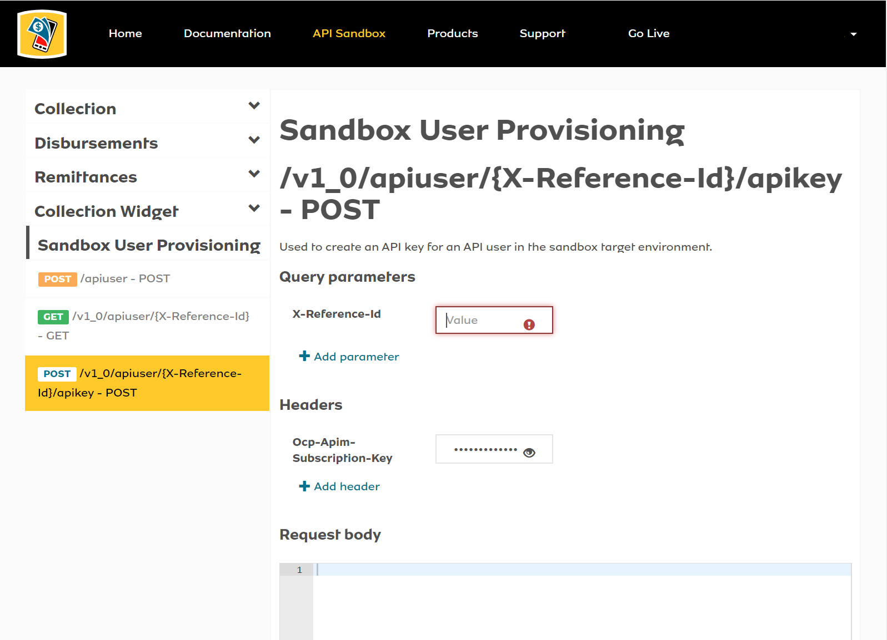
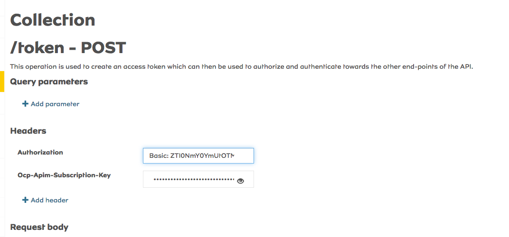

# mtn-momo-developer-basics
<!-- ALL-CONTRIBUTORS-BADGE:START - Do not remove or modify this section -->
[](#contributors-)
<!-- ALL-CONTRIBUTORS-BADGE:END -->
MTN MoMo Developer Basics is a repository aimed at giving developers a head start in interacting with the MTN MoMo API's found here: https://momodeveloper.mtn.com/

*Disclaimer: This repository is not officially affiliated with MTN*

# General Guidelines
The aim is to accommodate any framework, implementation or programming language. This repo will be organised by having individual branches catering to different solutions. Developers are free to contribute to any branch relevant to their skill or interest.

At a bare minimum, you will be expected to register on the [MTN MoMo Developer Portal](https://momodeveloper.mtn.com/) and follow the [Getting Started Guidelines](https://momodeveloper.mtn.com/api-documentation/getting-started/) to enable you to:

* Subscribe To MTN MoMo API Products
* Manage Your Subscriptions (`Primary Key` and `Secondary Key`)
* Generate *API User* and *API Key*

which will be necessary in interacting with the API using those credentials generated.

# Getting Started

1. Register Application

    The first thing you need to do to get started, after registering on the [MTN MoMo Developer Portal](https://momodeveloper.mtn.com/) and signing in, is going to your [User Profile Page](https://momodeveloper.mtn.com/developer) where you will find two (2) sections, one for **Your Subscriptions** and another for **Your Applications**. Here you will need to click on *Register application*, under **Your Applications**, and enter details for your application. This step is necessary in order to avoid getting a `401 Error` when trying to generate your Oauth 2.0 credentials under [Sandbox User Provisioning](https://momodeveloper.mtn.com/docs/services/sandbox-provisioning-api/operations/post-v1_0-apiuser).

    

    After saving the *Register Application* form, it will be submitted for approval, which should normally not take a long time.

2. Subscribe to MTN MoMo API Product

    You can now visit the [Products page](https://momodeveloper.mtn.com/products) to subscibe to a suitable product, you are not limited to just just one, four (4) are provided:
    1. **Collection Widget:** Receive mobile money payments on your website through a USSD or QR code
    1. **Collections:** Enable remote collection of bills, fees or taxes.
    1. **Disbursements:** Automatically deposit funds to multiple users
    1. **Remittances:** Remit funds to local recipients from the diaspora with ease

    For each product, there are options to *See full documentation* and *Subscribe*. Below is an example for *Colllection Widget*.

    

    Select *Subscribe* and you will be redirected to subscription page:

    

    Then click the yellow Subscribe button to be subscribed to the product.

    Now when you visit your [User Profile Page](https://momodeveloper.mtn.com/developer), you should see products to which you are subscribed to under **Your Subscriptions** section. Below is an example:

    

3. Create API User and API Key

    Under [API Sandbox](https://momodeveloper.mtn.com/docs/services/collection), select [Sandbox User Provisioning](https://momodeveloper.mtn.com/docs/services/sandbox-provisioning-api), you should be redirected to [/apiuser - POST endpoint testing page](https://momodeveloper.mtn.com/docs/services/sandbox-provisioning-api/operations/post-v1_0-apiuser?). Click the yellow *Try it* button to test if your application was registered.

    

    If you have no registered application or not logged in to your account, you will get an error `401 Access Denied` warning as shown below.

    

    Otherwise, there will be no error `401 Access Denied` warning and you should be able to create an API User. You will need to fill in *X-Reference-Id* and *providerCallbackHost* (if you will handle a callback URL, by replacing *string* with your callback URL), all other fields will be filled in automatically. According to the documentation, *X-Reference-Id* is a Version 4 'Universal Unique ID' (**UUID**), in order to quickly test this, you can generate a Version 4 **UUID** using this [Online UUID Generator](https://www.uuidgenerator.net/version4). Copy the generated UUID and paste in *X-Reference-Id* field. After clicking the yellow *Send* button, you should get a `201 Created` success response. The version 4 **UUID** is now your **API User**.

    

    Using the **API User** created in the previous step, visit the [/v1_0/apiuser/{X-Reference-Id}/apikey - POST endpoint testing page]() and paste it in the *X-Reference-Id* field, click the yellow *Send* button and you should get a `201 Created` success reponse with your **API Key**.

    

    Below is an example of the API Key response.

    ```
        Date: Mon, 11 Nov 2019 13:59:08 GMT
        Content-Length: 45
        Content-Type: application/json; charset=utf-8

        {
        "apiKey": "xxxxxxxxxxxxxxxxxxxxxxxxxxxxxxx"
        }
    ```

4. Generating an access token

    To call routes that require an access token, you first need to generate the token using the `/token` route.
    The `/token` route takes in an authorization header. The value to input here is the **API User** from the previous step and the **API Key**, in the following sequence **API User**:**API Key**, encoded in base64. Make sure that they are separated by a colon. To create it you can use online conversion tools, such as, [base64encode.net](https://www.base64encode.net/) or through downloadable packages, such as, [base-64](https://www.npmjs.com/package/base-64).

    Before you paste in your newly created encoded API User and Key, make sure to prefix it with `Basic `. That is "Basic" with a space afterwards as in the following image.

     


5. Automation

    And that's it, you're ready to start testing on the MTN MoMo API Sandbox. But, you don't want to be copying the generated keys and storing them in *.txt files, to be reused later. We need to create an automated solution that sends requests and stores resposnse data in a database, to be used by a web or mobile application. Each branch in this repo will have a different solution in achieving this.

# Contribution Guidelines
Contributions can be made through pull requests.
* You can start by forking this repo
* Contribute to a branch relevant to you, if it exists
* Otherwise, create a new branch, for a new implementation, for example; REST, Java, React, Vue, Laravel, etc
* Once you are ready and everything checks out, you can push to your forked repo and create a pull request against this repo
* We will then review and approve


## Contributors ✨

Thanks goes to these wonderful people ([emoji key](https://allcontributors.org/docs/en/emoji-key)):

<!-- ALL-CONTRIBUTORS-LIST:START - Do not remove or modify this section -->
<!-- prettier-ignore-start -->
<!-- markdownlint-disable -->
<table>
  <tr>
    <td align="center"><a href="http://oneziko.com"><br /><sub><b>Chizzo Cheese</b></sub></a><br /><a href="#content-Chizzoz" title="Content">🖋</a> <a href="https://github.com/Chizzoz/mtn-momo-developer-basics/commits?author=Chizzoz" title="Documentation">📖</a> <a href="#example-Chizzoz" title="Examples">💡</a></td>
    <td align="center"><a href="https://github.com/WillzMu"><br /><sub><b>Wilfred</b></sub></a><br /><a href="#content-WillzMu" title="Content">🖋</a> <a href="https://github.com/Chizzoz/mtn-momo-developer-basics/commits?author=WillzMu" title="Documentation">📖</a> <a href="#example-WillzMu" title="Examples">💡</a></td>
    <td align="center"><a href="http://www.mazitekgh.com"><br /><sub><b>Zakaria Mohammed</b></sub></a><br /><a href="https://github.com/Chizzoz/mtn-momo-developer-basics/commits?author=Zakaria16" title="Code">💻</a> <a href="#content-Zakaria16" title="Content">🖋</a> <a href="https://github.com/Chizzoz/mtn-momo-developer-basics/commits?author=Zakaria16" title="Documentation">📖</a> <a href="#example-Zakaria16" title="Examples">💡</a></td>
  </tr>
</table>

<!-- markdownlint-enable -->
<!-- prettier-ignore-end -->
<!-- ALL-CONTRIBUTORS-LIST:END -->

This project follows the [all-contributors](https://github.com/all-contributors/all-contributors) specification. Contributions of any kind welcome!