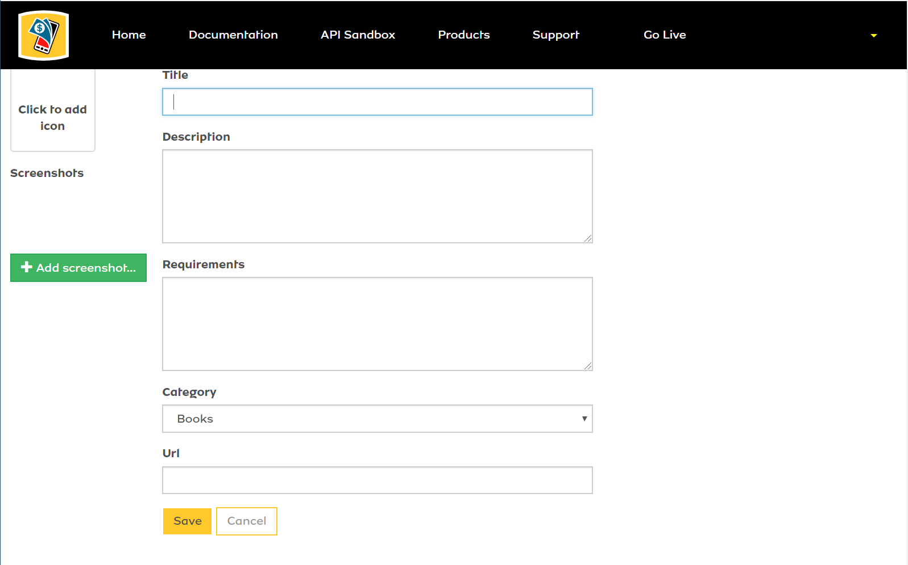
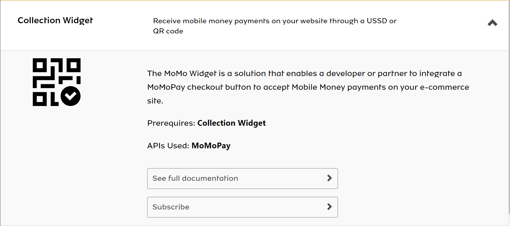
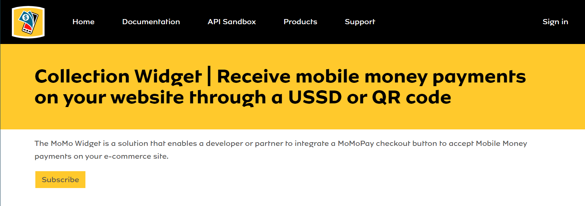
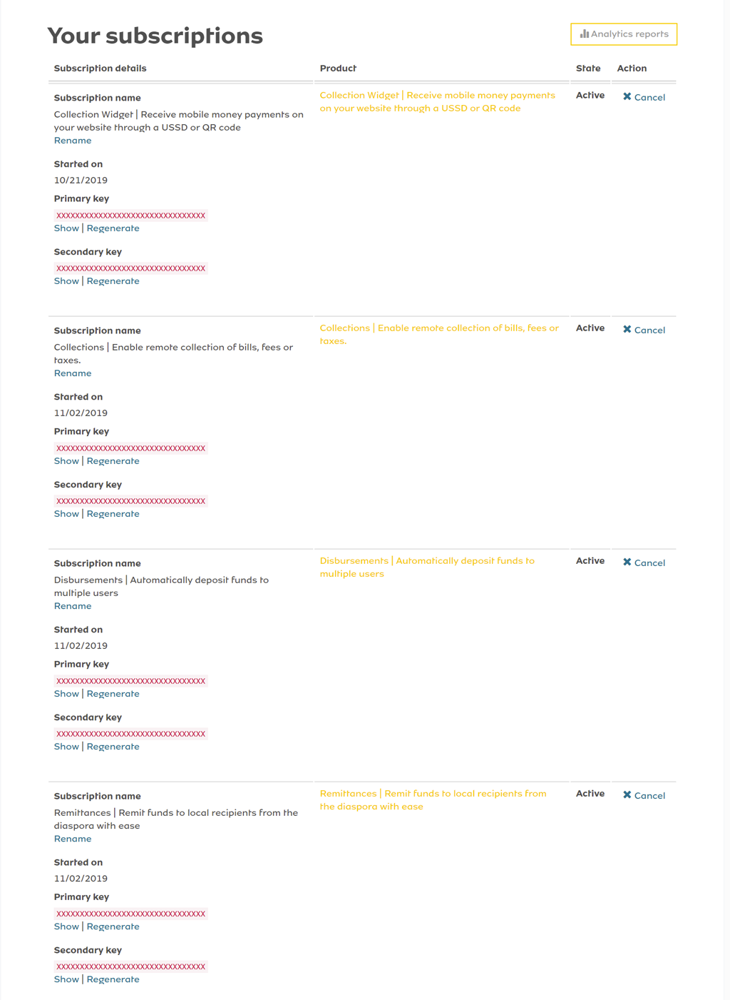

# mtn-momo-developer-basics
MTN MoMo Developer Basics is a repository aimed at giving developers a head start in interacting with the MTN MoMo API's found here: https://momodeveloper.mtn.com/

*Disclaimer: This repository is not officially affiliated with MTN*

# Getting Started
if you have already registered and have subscribe to the collection product then go straight to [How to use the PHP API](#how-to-use-the-php-api-how-to)
1. Register Application

    The first thing you need to do to get started, after registering on the [MTN MoMo Developer Portal](https://momodeveloper.mtn.com/) and signing in, is going to your [User Profile Page](https://momodeveloper.mtn.com/developer) where you will find two (2) sections, one for **Your Subscriptions** and another for **Your Applications**. Here you will need to click on *Register application*, under **Your Applications**, and enter details for your application. This step is necessary in order to avoid getting a `401 Error` when trying to generate your Oauth 2.0 credentials under [Sandbox User Provisioning](https://momodeveloper.mtn.com/docs/services/sandbox-provisioning-api/operations/post-v1_0-apiuser).

    

    After saving the *Register Application* form, it will be submitted for approval, which should normally not take a long time.

2. Subscribe to MTN MoMo API Product

    You can now visit the [Products page](https://momodeveloper.mtn.com/products) to subscibe to a suitable product, you are not limited to just just one, four (4) are provided:
   
    1. **Collections:** Enable remote collection of bills, fees or taxes.

    For each product, there are options to *See full documentation* and *Subscribe*. Below is an example for *Colllection Widget*.

    

    Select *Subscribe* and you will be redirected to subscription page:

    

    Then click the yellow Subscribe button to be subscribed to the product.

    Now when you visit your [User Profile Page](https://momodeveloper.mtn.com/developer), you should see products to which you are subscribed to under **Your Subscriptions** section. Below is an example:

    

# How to use the PHP API {#how-to}

see the `index.php` for example on how to use the API

```php
include_once 'includes/MomoAPI.php';
include_once 'includes/RequestPayBody.php';

//first create an instant of MomoAPI with subscription key as parameter
$momoTest = new MomoAPI('eeabff77f35c4ad8b7037a0d4cab14f2');

//create user and get unique uuid version 4 if successful
$uuid = $momoTest->createAPIUser(null, 'https://ggg.com');

echo ($uuid) ? "<br/>api user = $uuid <br/>" : "<br/>failed to create user<br/>";

// get api_key for the user
$apiKey = $momoTest->get_api_key($uuid);
echo "api key = $apiKey <br/>";

//get access token for the user using his/her uuid and api_key
$token = $momoTest->get_access_token($uuid, $apiKey);

echo "access_token = $token->access_token <br/>";
```
now with your access token you can now **accept payment**, **check balance** and so on
```php
$requestBody =
    new RequestPayBody("MSISDN", '46733123453', 40, 'EUR', "jkjkjhkbh",
        "some msg", "dsmndsm");

$payStatus = $momoTest->requestPay($token->access_token, $requestBody, 'https://ggg.com', $uuid);
if ($payStatus) {
    $payment = $momoTest->checkPaymentStatus($token->access_token, $uuid);
}

echo "<br/> pay_status=";
print_r($payment);


$bal = $momoTest->checkBalance($token->access_token);
echo "<br/> bal= ";
print_r($bal);

$isActive = $momoTest->isUserAccountActive($token->access_token, 'MSISDN', '0541355996');

echo ($isActive) ? "<br/>is Active" : "<br/>not Active";
```
These numbers can be used for testing


|Number	|Response|
|-------|------|
| 46733123450 | failed |
|46733123451|	rejected |
|46733123452	| timeout |
|46733123453 |	ongoing (will answer pending first and if requested again after 30 seconds it will respond success)|
|46733123454|pending|

# Contribution Guidelines
Contributions can be made through pull requests.
* You can start by forking this repo
* Contribute to a branch relevant to you, if it exists
* Otherwise, create a new branch, for a new implementation, for example; REST, Java, React, Vue, Laravel, etc
* Once you are ready and everything checks out, you can push to your forked repo and create a pull request against this repo
* We will then review and approve


[#how-to]: #how-to
